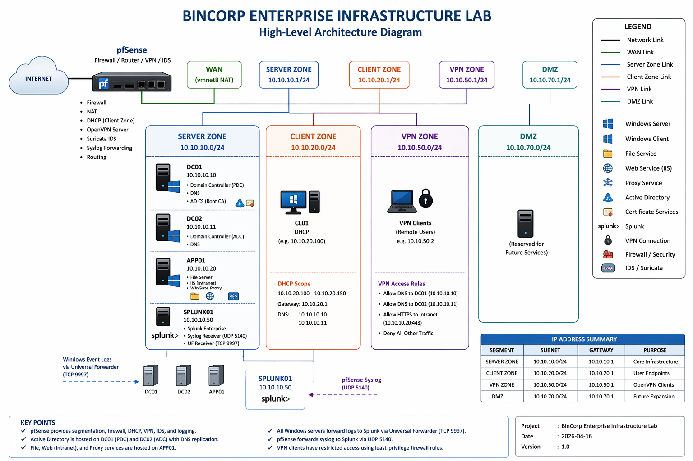

# BinCorp Enterprise Infrastructure Lab

## Overview
This project is a hands-on enterprise infrastructure lab that simulates the IT environment of a building management and office leasing company named **BinCorp**. The lab was designed to combine identity services, secure internal services, controlled remote access, web filtering, intrusion detection, and centralized monitoring into one cohesive environment.

The objective of the project is not only to deploy infrastructure, but also to validate that security controls are working through practical use cases such as failed logon detection, VPN access logging, proxy-based website blocking, and domain service redundancy.

---

## Business Scenario
BinCorp is modeled as a company operating a managed office building / office leasing environment. Its IT system requires:

- centralized authentication and authorization
- secure file sharing by department
- an internal HTTPS intranet
- controlled employee web access
- secure remote access for authorized staff
- centralized monitoring and event visibility
- resilience at the domain service layer

This lab was built to reflect those requirements in a realistic, small-scale enterprise architecture.

---

## Project Goals
The main goals of the lab were:

- design and deploy a segmented enterprise-style network
- implement Active Directory with redundant Domain Controllers
- secure internal services with internal PKI and HTTPS
- enforce access control on shared folders
- deploy and validate proxy-based web filtering
- implement VPN access with least-privilege rules
- deploy IDS capability with Suricata
- centralize Windows and pfSense logs into Splunk
- create demonstrable security use cases for portfolio presentation

---

## Architecture Summary



### Core Infrastructure
- **pfSense** as firewall, gateway, and VPN concentrator
- **DC01** as primary Domain Controller / DNS
- **DC02** as secondary Domain Controller / DNS
- **APP01** as internal application/service server
- **SPLUNK01** as centralized log and monitoring server
- **CL01** as domain-joined endpoint/client

### Major Services
- Active Directory Domain Services
- DNS
- Internal Certificate Authority (AD CS)
- File Server with share/NTFS permission model
- IIS-based intranet over HTTPS
- WinGate Proxy with web access rules
- OpenVPN remote access
- Suricata IDS
- Splunk Enterprise
- Splunk Universal Forwarders
- pfSense remote syslog forwarding

---

## Logical Network Design

### Zones
- **WAN**
- **Server Zone**
- **Client Zone**
- **DMZ**
- **VPN Subnet**

### Main Subnets
- **Server Zone:** `10.10.10.0/24`
- **Client Zone:** `10.10.20.0/24`
- **VPN Zone:** `10.10.50.0/24`
- **DMZ:** `10.10.70.0/24`

### Key Hosts
- **pfSense LAN / Server Gateway:** `10.10.10.1`
- **DC01:** `10.10.10.10`
- **DC02:** `10.10.10.11`
- **APP01:** `10.10.10.20`
- **SPLUNK01:** `10.10.10.50`
- **CL01:** DHCP from `10.10.20.0/24`

---

## Technology Stack

### Network and Security
- pfSense
- OpenVPN
- Suricata IDS
- WinGate Proxy

### Identity and Infrastructure
- Windows Server
- Active Directory Domain Services
- DNS
- Active Directory Certificate Services
- IIS

### Monitoring and Logging
- Splunk Enterprise
- Splunk Universal Forwarder
- Windows Event Logs
- pfSense remote syslog

### Virtualization
- VMware Workstation

---

## Implemented Components

### 1. pfSense Firewall and Segmentation
pfSense was deployed as the network edge device and configured with multiple interfaces to separate the environment into functional zones. It also provides routing, firewall enforcement, VPN termination, and remote syslog forwarding.

Implemented functions:
- interface assignment for WAN / Server / Client / DMZ
- DHCP for the client network
- firewall rules for segmentation
- OpenVPN configuration
- remote syslog forwarding
- Suricata integration

---

### 2. Active Directory with Redundant Domain Controllers
A dual-DC design was implemented using `DC01` and `DC02` to provide domain service redundancy.

Implemented functions:
- new forest / domain deployment
- DNS on both Domain Controllers
- replication validation
- AD Sites and Services verification
- fault tolerance validation at the domain layer

---

### 3. Department-Based File Access Control
A role-based file-sharing model was created on `APP01` using security groups and share/NTFS permissions.

Examples:
- Public share
- Reception share
- Accounting share
- Engineering share
- Leasing share
- Management share
- IT share

Implemented controls:
- AD security groups
- file share permissions
- NTFS permissions
- department-based access boundaries

---

### 4. Internal Intranet over HTTPS
An internal IIS-based intranet was deployed on `APP01` and secured with an internally issued certificate.

Implemented functions:
- IIS deployment
- internal HTML intranet page
- DNS record for `intranet.bincorp.local`
- HTTPS binding
- certificate issued by internal Enterprise CA

---

### 5. Internal PKI
An internal Certification Authority was deployed using AD CS.

Implemented functions:
- Enterprise Root CA
- issued Web Server certificate
- certificate binding to IIS
- internal trust path for HTTPS intranet

---

### 6. Proxy and Web Access Control
WinGate was deployed on `APP01` as a proxy service for web access control.

Implemented functions:
- proxy configuration on CL01
- outbound web access through proxy
- block rule for selected websites
- traffic/activity review in WinGate

---

### 7. Secure Remote Access
OpenVPN was configured on pfSense to provide remote access.

Implemented functions:
- VPN CA and server certificate
- VPN user certificate
- client export
- VPN subnet allocation
- least-privilege firewall rules for VPN clients

---

### 8. Intrusion Detection
Suricata was deployed on pfSense in IDS mode.

Implemented functions:
- rule source update
- WAN and CLIENT interface monitoring
- alert generation validation
- IDS visibility in the virtualized environment

---

### 9. Centralized Monitoring with Splunk
Splunk Enterprise was deployed on `SPLUNK01` and integrated with both Windows and pfSense log sources.

Implemented functions:
- local Windows event collection on SPLUNK01
- Universal Forwarder on DC01, DC02, and APP01
- pfSense syslog forwarding to Splunk via UDP
- search validation for Windows and firewall/VPN events

---

## Security Controls Implemented

This lab includes practical examples of the following control areas:

- centralized identity and authentication
- role-based access control
- segmented network communication
- secure remote access
- internal cryptographic trust
- controlled web access
- intrusion detection
- centralized event logging
- domain-layer redundancy
- recovery-oriented infrastructure thinking

A fuller mapping is available in:
- `docs/security-controls-mapping.md`

---

## Validation Use Cases

The environment was validated through multiple practical use cases.

### Use Case 1 — Failed Logon Detection
A domain user intentionally failed authentication on CL01. The event was recorded by a Domain Controller and collected into Splunk as Security Event `4625`.

### Use Case 2 — VPN Access Detection
An OpenVPN client connected successfully, received an IP from the VPN subnet, accessed internal resources, and generated pfSense OpenVPN events that were collected into Splunk.

### Use Case 3 — Proxy Block Enforcement
Allowed sites remained accessible through the proxy, while a restricted site such as YouTube was blocked according to the configured web access rule.

### Use Case 4 — Domain Controller Redundancy Validation
DC01 was powered off and the environment was validated to confirm that domain-related services remained available through DC02.

### Use Case 5 — HTTPS Intranet Validation
The internal portal was accessed successfully over HTTPS using a certificate issued by the internal Enterprise Root CA.

Full details are documented in:
- `docs/use-cases.md`

---

## Splunk Data Sources

### Windows Hosts
- SPLUNK01
- DC01
- DC02
- APP01

### Network / Firewall
- pfSense syslog
- OpenVPN events

### Example Searches
Failed logons:
```spl
index=main (host="DC01" OR host="DC02") source="WinEventLog:Security" EventCode=4625
```

VPN events:
```spl
index=main host="10.10.10.1" "openvpn"
```

APP01 events:
```spl
index=main host="APP01"
```

DC01 events:
```spl
index=main host="DC01"
```

DC02 events:
```spl
index=main host="DC02"
```

## Limitations

This lab was intentionally designed as an enterprise-style learning and portfolio environment, so some limitations remain.

### Current Limitations
the application tier is still largely single-instance
APP01 hosts multiple roles, which is practical for a lab but not ideal for production separation
file services are not deployed with DFS-based redundancy
pfSense is a single firewall instance
Splunk is a single monitoring instance
Suricata is implemented as a lab IDS layer, not a fully tuned production deployment
Windows client DNS failover behavior can be slower than expected during short failover demonstrations
Important Note

This project demonstrates real control implementation and validation, but it does not claim full production-grade HA across every application layer.

## Future Improvements
The following enhancements could further mature the project:

- add a second application/file node
- implement DFS Namespace and DFS Replication for file service redundancy
- separate file, proxy, and web roles
- add richer Splunk dashboards and alerts
- ingest WinGate logs into Splunk
- tune Suricata rules and alerts further
- add backup validation procedures
- document recovery runbooks in more depth

## Key Takeaways
This lab demonstrates how multiple enterprise components can be integrated into one realistic environment:

- identity and access control with AD
- secure internal service delivery with PKI and HTTPS
- network segmentation and firewall enforcement
- policy-driven proxy filtering
- VPN-based remote access
- IDS visibility with Suricata
- centralized monitoring with Splunk
- redundancy at the domain service layer

The value of the project is not just in installing tools, but in validating how they interact through practical security and operational use cases.

# Author Note
This project was built as a practical enterprise infrastructure and security lab for learning, portfolio development, and technical discussion. It reflects hands-on deployment, troubleshooting, and validation rather than purely theoretical design.